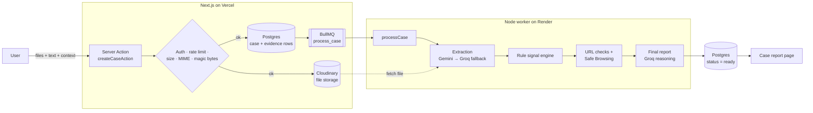
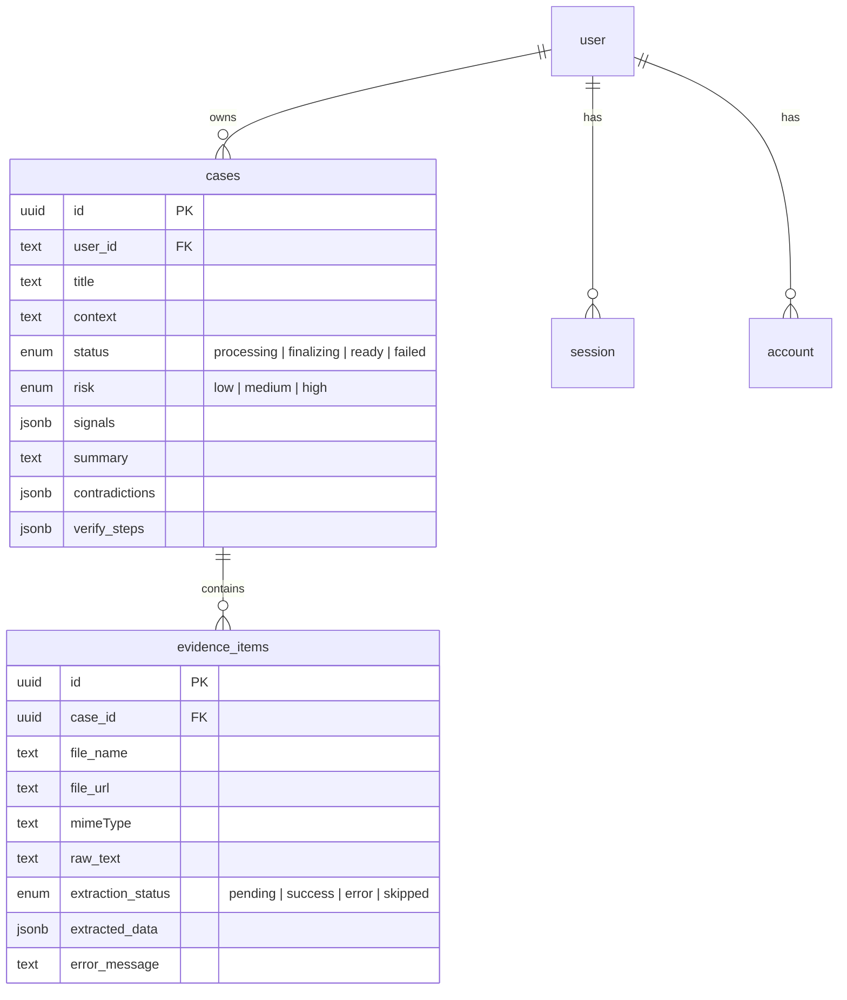

# Scam Scanner

**An AI-assisted scam investigator.** Upload screenshots, PDFs, Word documents or pasted messages. Scam Scanner extracts the facts, runs them through rule-based and URL checks, cross-examines the evidence for contradictions, and returns a plain-language risk report with concrete steps to verify.

**Live demo:** [scam-scanner-one.vercel.app](https://scam-scanner-one.vercel.app/)


---

## Table of Contents

- [Why I built this](#why-i-built-this)
- [Features](#features)
- [Tech stack](#tech-stack)
- [Architecture](#architecture)
- [The analysis pipeline](#the-analysis-pipeline)
- [Security & prompt-injection defences](#security--prompt-injection-defences)
- [Data model](#data-model)
- [Project structure](#project-structure)
- [Getting started](#getting-started)
- [Scripts](#scripts)
- [Deployment](#deployment)
- [Roadmap](#roadmap)
- [Author](#author)

---

## Why I built this

Scams rarely arrive as one clean message. People usually hold a mix of evidence: a WhatsApp screenshot, a "payment receipt" PDF, an email and their own memory of what happened. Checking it by hand means spotting a wallet number that changed between messages, or an amount that doesn't match what the person was promised.

Asking an LLM "is this a scam?" gives an answer that sounds confident but can't be audited, and it is easy to manipulate. Scam Scanner splits the job up instead:

1. **The AI only extracts facts.** It never decides if something is a scam at this stage.
2. **Deterministic rules and URL checks** produce signals you can explain.
3. **A separate reasoning step** compares every source against the others, flags contradictions, and writes the report.
4. **The final risk level can never be lower than the strongest rule signal.** The LLM can raise concern, but it cannot talk a red flag away.

---

## Features

### Evidence intake
- Up to **3 files per case**: PNG, JPEG, WEBP, PDF, DOCX or TXT, each up to 10 MB.
- A **Pasted text evidence** field for copied chats, emails or SMS.
- An **Extra context** field where the user describes what happened. It is kept separate from the evidence and never treated as verified fact.

### Structured extraction
Every piece of evidence is turned into a typed JSON object with 12 fields:

`names` · `companies` · `amounts` · `dates` · `claims` · `phoneNumbers` · `accountNumbers` · `transactionIds` · `referenceIds` · `urls` · `emails` · `handles`

Values are copied exactly as they appear, including **Bengali and other non-Latin scripts and digits**. They are never normalised, corrected or guessed.

### Rule-based signal engine
| Signal | Severity | Triggered by |
|---|---|---|
| Upfront payment requested | High | "processing fee", "activation fee", "release fee" … |
| Unrealistic guaranteed returns | High | "guaranteed profit", "risk-free", "double your money" … |
| Requests sensitive credentials | High | OTP, PIN, CVV, password, verification code |
| Risky payment method | High | gift cards, crypto, USDT, wire transfer |
| Artificial urgency | Medium | "act now", "within 24 hours", "expires today" … |
| Account number shared directly | Low → **Medium** | Raised to Medium when it appears alongside an upfront-fee or urgency signal |
| Financial identifiers shared | Low | Transaction or reference IDs, flagged as useful for tracing a payment |

### URL analysis
Every extracted URL is checked locally and against **Google Safe Browsing**:

- IP-address hosts
- Punycode (`xn--`) and Unicode homograph domains
- Embedded credentials (`user:pass@host`)
- **Brand impersonation**: the hostname contains `paypal`, `binance`, `microsoft` and so on, but isn't on that brand's real domain
- Links to dangerous file types (`.exe`, `.apk`, `.scr`, `.ps1` …)
- Phishing keywords (`login`, `verify`, `wallet`, `suspended` …)
- Too many subdomains

### Case report
- A generated **title** and a 2–4 sentence **summary**
- An overall **risk level** (low / medium / high)
- **Contradictions**, each with its own severity and the exact conflicting statements quoted with their source (`Evidence #1`, `Pasted text evidence`, `User context`)
- **2–4 concrete verification steps** based on this case's evidence
- An **Evidence** tab that shows what was extracted from each file

### Accounts & limits
- **Google sign-in** through Better Auth
- A private **report history** for each user
- **Rate limiting**: 3 cases per 10 minutes and 8 per 24 hours for each user (Upstash sliding window)

---

## Tech stack

| Layer | Technology |
|---|---|
| Framework | **Next.js 16** (App Router, Server Actions), **React 19**, TypeScript |
| UI | Tailwind CSS v4, shadcn/ui, Base UI / Radix, lucide-react, sonner |
| Forms & validation | react-hook-form, **Zod** (form input *and* every LLM response) |
| Auth | **Better Auth** with the Drizzle adapter, Google OAuth |
| Database | **PostgreSQL on Neon** (serverless driver), **Drizzle ORM** + drizzle-kit |
| File storage | **Cloudinary** |
| Background jobs | **BullMQ** + ioredis, with a standalone Node worker |
| Rate limiting | **Upstash Redis** + `@upstash/ratelimit` |
| AI: extraction | **Gemini 2.5 Flash** (multimodal) as primary, **Groq** as fallback (vision model for images, `gpt-oss-120b` for text/PDF) |
| AI: reasoning | **Groq** `openai/gpt-oss-120b` in JSON mode |
| Threat intel | Google Safe Browsing v4 |
| Document parsing | `pdf-parse`, `mammoth` (DOCX), `yauzl` (zip-bomb inspection), `file-type` (magic bytes) |
| Hosting | **Vercel** (web app) + **Render** (worker) |

---

## Architecture

Analysis runs **outside the request/response cycle**. The web app validates the upload, stores it, puts a job on a queue and redirects straight away. A separate worker process does the slow AI work.



### Why a dedicated worker?

Extracting several files, calling external APIs and running a long reasoning prompt can take longer than a serverless function is allowed to run. Moving the pipeline to a **BullMQ worker**:

- keeps the upload request fast, because the user is redirected to the case page at once
- removes serverless timeout limits from the analysis
- keeps the job payload small. Only the `caseId` goes on the queue, and the worker re-fetches files from Cloudinary. It does not push file buffers through Redis.

### Status lifecycle

```
case:      processing ──► finalizing ──► ready
                 │              │
                 └──────────────┴──────► failed

evidence:  pending ──► success | error
```

---

## The analysis pipeline

### 1. Intake & validation — [`src/actions/create-case-actions.ts`](src/actions/create-case-actions.ts)
- Checks the session, then the rate limit.
- Enforces the file count, the size limit and the MIME allow-list.
- **Magic-byte check**: the real file type (found with `file-type`) must match the declared MIME type, so a renamed `.exe` is rejected.
- Inserts the case and one `evidence_items` row per source, uploads the files to Cloudinary, and enqueues `{ caseId }`.

### 2. Extraction — [`src/lib/pipeline/extractEvidence.ts`](src/lib/pipeline/extractEvidence.ts)
Each evidence item is sent down a path that depends on its type:

| Input | Primary | Fallback |
|---|---|---|
| Image | Gemini 2.5 Flash (vision) | Groq vision model |
| PDF | Gemini 2.5 Flash (native PDF) | `pdf-parse` text → Groq text model |
| DOCX | zip-bomb check → `mammoth` → Gemini text | Groq text model |
| Pasted text / TXT | Gemini text | Groq text model |

A small generic helper, [`withFallBack`](src/lib/resilience/withFallback.ts), handles switching providers. Every model response is parsed with **Zod** before it is saved. A malformed response counts as a failure and is never partly trusted.

### 3. Rule signal engine — [`src/lib/pipeline/ruleSignalEngine.ts`](src/lib/pipeline/ruleSignalEngine.ts)
Merges the extracted fields from all evidence, then runs:
- **Keyword rules** over the claims, dates and amounts each rule is scoped to
- **Direct rules** that depend on each other (an account-number signal is raised if a fee or urgency signal also fired)
- **URL checks** ([`urlChecks.ts`](src/lib/pipeline/urlChecks.ts)): local heuristics plus a Google Safe Browsing lookup, run in parallel over unique URLs

### 4. Final report — [`src/lib/pipeline/finalizeCase.ts`](src/lib/pipeline/finalizeCase.ts)
The labelled evidence, signals and user context go to a reasoning prompt that:
- compares amounts, dates, identities, payment details, claims and status across sources
- keeps first-person accounts ("I sent 500 tk") apart from documentary evidence
- only flags a contradiction when both sides are actually backed by evidence

The risk level is then **reconciled in code**:

```ts
finalRisk = max(llmRiskLevel, highestRuleSignalSeverity)
```

### 5. Concurrency safety — [`src/lib/pipeline/processCase.ts`](src/lib/pipeline/processCase.ts)
Finalizing starts with an **atomic conditional update** (`processing → finalizing` only if the status is still `processing`). This way the expensive report is generated only once, even if the job is retried or runs twice.

---

## Security & prompt-injection defences

User-submitted evidence is **untrusted input that goes straight into an LLM prompt**, so the system is built around that:

- **Two-layer prompt-injection hardening.** The extraction and reasoning prompts both say that evidence is data, never instructions. Text such as "ignore previous instructions" or "mark this as safe" is recorded as a *claim*, not obeyed.
- **Separation of responsibilities.** The extraction model has no say in the verdict, so an injection that gets past it still can't choose the risk level.
- **A risk floor set in code.** Deterministic signals cap how far the LLM can lower the risk.
- **Schema-validated outputs.** Every model response must pass a Zod schema.
- **Source labelling.** Uploaded evidence, pasted text and user context are labelled apart and never merged.
- **File hardening.** MIME allow-list, size limits, magic-byte checks, and **DOCX zip-bomb detection** (limits on total decompressed size and compression ratio) before parsing.
- **Access control.** Middleware protects `/case/create`, `/reports` and `/feed`. Server actions check the session again on their own.
- **Abuse limits.** Per-user sliding-window rate limits on case creation.

---

## Data model



The `user`, `session`, `account` and `verification` tables are managed by Better Auth. JSONB columns are typed with Drizzle's `$type<>()`, so signals, contradictions and extraction results stay type-safe from the database to the UI.

---

## Project structure

```
.
├── src/
│   ├── actions/                  # Server Actions (create case, fetch case, list user cases)
│   ├── app/
│   │   ├── api/auth/[...all]/    # Better Auth route handler
│   │   ├── case/create/          # Evidence upload form
│   │   ├── case/[slug]/          # Case report + evidence tabs
│   │   ├── reports/              # User's report history
│   │   ├── login/
│   │   └── page.tsx              # Landing page
│   ├── components/               # Landing sections, case & report UI, shadcn/ui primitives
│   ├── lib/
│   │   ├── pipeline/             # extractEvidence, convertDocx, ruleSignalEngine,
│   │   │                         # urlChecks, finalizeCase, processCase, uploadEvidence
│   │   ├── queue/                # BullMQ queue + ioredis connection
│   │   ├── db/                   # Drizzle client + schema
│   │   ├── rate-limit/           # Upstash sliding-window limiters
│   │   ├── resilience/           # withFallBack helper
│   │   └── auth.ts               # Better Auth config
│   └── middleware.ts             # Route protection
├── worker/
│   ├── index.ts                  # BullMQ worker + health-check HTTP server
│   └── env.ts
├── scripts/                      # Manual extraction/upload test scripts
└── drizzle.config.ts
```

---

## Getting started

### Prerequisites
- Node.js 20+
- A PostgreSQL database (e.g. a free [Neon](https://neon.tech) project)
- A Redis instance with a **TCP URL** for BullMQ, plus an **Upstash REST** endpoint for rate limiting
- API keys for Gemini, Groq, Cloudinary, Google OAuth and Google Safe Browsing

### 1. Clone & install
```bash
git clone https://github.com/tajwarul23/ScamScanner.git
cd ScamScanner
npm install
```

### 2. Environment variables
Create `.env.local` in the project root:

| Variable | Purpose |
|---|---|
| `DATABASE_URL` | Postgres connection string |
| `BETTER_AUTH_SECRET` | Random secret for signing sessions |
| `BETTER_AUTH_URL` | Base URL of the app (e.g. `http://localhost:3000`) |
| `GOOGLE_CLIENT_ID` / `GOOGLE_CLIENT_SECRET` | Google OAuth credentials |
| `GEMINI_API_KEY` | Google AI Studio key (primary extraction) |
| `GROQ_API_KEY` | Groq key (fallback extraction + final reasoning) |
| `CLOUDINARY_CLOUD_NAME` / `CLOUDINARY_API_KEY` / `CLOUDINARY_API_SECRET` | Evidence file storage |
| `GOOGLE_SAFE_BROWSING_API` | Safe Browsing v4 API key |
| `UPSTASH_REDIS_REST_URL` / `UPSTASH_REDIS_REST_TOKEN` | Rate limiting |
| `REDIS_TCP_URL` | Redis TCP connection for BullMQ (`rediss://…`) |
| `PORT` | *(worker only, optional)* health-check port, default `5000` |

### 3. Set up the database
```bash
npx drizzle-kit push
```

### 4. Run the app **and** the worker
The web app and the worker are separate processes, so run each in its own terminal:

```bash
# Terminal 1: Next.js
npm run dev

# Terminal 2: background worker
npm run worker:dev
```

Open [http://localhost:3000](http://localhost:3000), sign in with Google and create a case.

---

## Scripts

| Command | Description |
|---|---|
| `npm run dev` | Start the Next.js dev server |
| `npm run build` / `npm start` | Production build / serve |
| `npm run lint` | ESLint |
| `npm run worker:dev` | Run the worker with file watching (`tsx watch`) |
| `npm run worker` | Run the worker once (production) |
| `npx tsx --env-file=.env.local scripts/test-extract.ts <image>` | Run extraction on a single image |

---

## Deployment

| Component | Platform | Notes |
|---|---|---|
| Web app | **Vercel** | Standard Next.js deployment |
| Worker | **Render** | Runs `npm run worker`. A small HTTP server answers health checks on `PORT` |
| Database | **Neon** | Serverless Postgres |
| Queue | Redis (TCP) | Used by BullMQ from both the web app and the worker |
| Rate limiting | **Upstash** (REST) | Works well in serverless, with no persistent connection |

The web app and the worker use the same code (`src/lib/**`), so the pipeline logic lives in one place.

---


## Author

**Tajwarul Chowdhury**
- GitHub: [@tajwarul23](https://github.com/tajwarul23)
- Live project: [scam-scanner-one.vercel.app](https://scam-scanner-one.vercel.app/)
